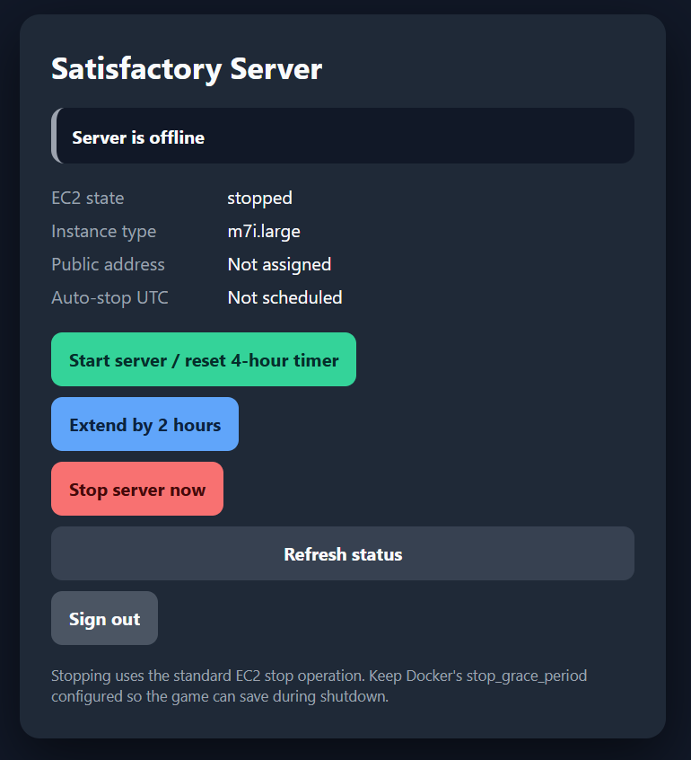
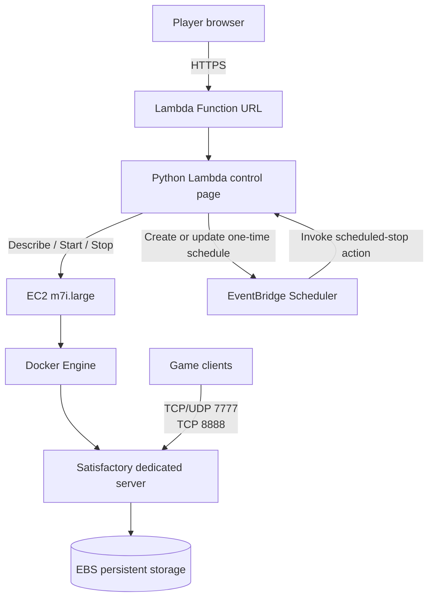

# On-Demand Satisfactory Server on AWS

A cost-conscious, on-demand dedicated server for **Satisfactory**, hosted on Amazon EC2 and managed through a lightweight authenticated web control panel.

The project combines an EC2-hosted Docker game server with an AWS Lambda control page that allows authorized players to start, extend, or stop the server without needing access to the AWS console. A one-time Amazon EventBridge Scheduler task automatically stops the instance after a configurable amount of time, reducing the cost of leaving a game server running when nobody is using it.



## Project goals

Most managed game-server hosts charge a fixed monthly price, while a continuously running cloud VM can be unnecessarily expensive for a group that only plays occasionally. This project was designed around a different usage pattern:

- Start the server only when players need it
- Keep the same persistent game world between sessions
- Give trusted players a simple web interface
- Automatically stop the instance if everyone forgets
- Keep AWS permissions limited to one EC2 instance
- Preserve the ability to inspect, customize, and monitor the underlying server

## Architecture



## Main components

### EC2 game server

The dedicated server runs on an **EC2 `m7i.large` instance** in the AWS Oregon region.

Current server configuration:

- Ubuntu Linux
- 2 vCPUs
- 8 GiB RAM
- General Purpose SSD-backed EBS storage
- Docker and Docker Compose
- Persistent save data mounted from the host
- On-Demand EC2 pricing
- Instance stopped between play sessions

The instance can be resized later without rebuilding the project. For example, a larger save or heavier multiplayer workload could be moved to an `m7i.xlarge` by stopping the instance, changing the instance type, and starting it again.

### Dockerized Satisfactory server

The game server uses the community-maintained [`wolveix/satisfactory-server`](https://github.com/wolveix/satisfactory-server) image.

Example Compose configuration:

```yaml
services:
  satisfactory-server:
    image: wolveix/satisfactory-server:latest
    container_name: satisfactory-server
    hostname: satisfactory-server
    restart: unless-stopped
    stop_grace_period: 2m

    ports:
      - "7777:7777/tcp"
      - "7777:7777/udp"
      - "8888:8888/tcp"

    volumes:
      - /srv/satisfactory:/config

    environment:
      PUID: "1000"
      PGID: "1000"
      MAXPLAYERS: "4"
      AUTOSAVENUM: "10"
      MAXTICKRATE: "30"
      STEAMBETA: "false"
      SKIPUPDATE: "false"

    mem_reservation: 4g
    mem_limit: 7g
```

The bind mount keeps the world, configuration, logs, and game files on the EBS volume rather than inside the disposable container layer:

```text
/srv/satisfactory
├── backups
├── gamefiles
├── logs
└── saved
```

Recreating or updating the container does not remove the saved world.

### Lambda control page

The control page is implemented as an inline Python Lambda function and exposed through a Lambda Function URL.

It provides:

- Username and password login form
- Secure, HTTP-only authentication cookie
- CSRF protection for control actions
- Current EC2 state
- Current public IP and game port
- Instance type display
- Game-port readiness check
- Start server button
- Resettable automatic shutdown timer
- Extend timer button
- Stop server button
- Sign-out button
- Automatic refresh while the instance is changing state

The page accepts HTTP Basic authentication as an additional option for command-line clients, while browsers use the normal login form.

## Automatic shutdown

When the Start button is pressed, the Lambda function:

1. Reads the current EC2 state.
2. Starts the instance if it is stopped.
3. Calculates a shutdown deadline.
4. tags the instance with the deadline.
5. Creates a one-time EventBridge Scheduler task.
6. Displays the updated state on the control page.

The default timer is four hours and is configurable through the CloudFormation parameters.

The Extend button adds time to the existing deadline instead of replacing it with a timer based only on the current time.

The Stop button:

- Deletes the active schedule
- Removes the shutdown-deadline tag
- Sends the normal EC2 stop request

The scheduled event includes the expected shutdown timestamp. Before stopping the instance, Lambda compares that timestamp with the EC2 tag. This prevents an older schedule from stopping the instance after the timer has been replaced or extended.

## Graceful server shutdown

A standard EC2 stop operation initiates an operating-system shutdown. Docker then stops the Satisfactory container.

The Compose configuration includes:

```yaml
stop_grace_period: 2m
```

This gives the server additional time to save and exit before Docker forcefully terminates the process.

Players should still disconnect cleanly and create a manual save before ending an important session.

## Cost optimization

The instance is billed for compute only while it is running. The EBS volume remains available while the instance is stopped, so the server installation and world persist between sessions.

This design is well suited to a group that plays for a few hours per week:

```text
Monthly cost
├── EC2 compute during active sessions
├── EBS storage while running or stopped
├── Public IPv4 usage, if assigned
└── Minimal Lambda and EventBridge usage
```

The Lambda and Scheduler workloads are very small. Most of the project cost comes from EC2 runtime, storage, and public addressing.

An Elastic IP can provide a stable address, while a dynamic-DNS update process can avoid retaining a static public IPv4 address while the instance is stopped.

## Security design

The CloudFormation template includes several controls intended to limit the impact of the public control page:

- Lambda Function URL is HTTPS-only
- Application-level username and password authentication
- Password value is hidden in CloudFormation inputs
- Authentication cookie uses `Secure`, `HttpOnly`, and `SameSite=Strict`
- Constant-time comparisons are used for credentials and tokens
- State-changing actions use HTTP POST
- CSRF token validation is required
- Content Security Policy restricts browser content
- Page cannot be framed by another site
- Lambda IAM permissions are limited to the selected EC2 instance
- Scheduler permissions are limited to the project's named schedule
- Scheduler can invoke only the control Lambda
- No AWS credentials are exposed to the browser

The Function URL uses `AuthType: NONE` because the page is intended for normal browser access rather than IAM-signed requests. Authentication and authorization are enforced inside the Lambda function.

For a production or larger shared environment, potential upgrades would include AWS Cognito, Cloudflare Access, Secrets Manager, or identity-based access rather than a shared password.

## CloudFormation deployment

The control plane is deployed from:

```text
cloudformation-control-page.yaml
```

### Parameters

| Parameter | Purpose | Default |
|---|---|---:|
| `InstanceId` | EC2 instance controlled by the page | Required |
| `BasicAuthUsername` | Control-page username | `satisfactory` |
| `BasicAuthPassword` | Control-page password | Required |
| `AutoStopHours` | Initial automatic shutdown timer | `4` |
| `ExtendHours` | Time added by the Extend button | `2` |

### Resources created

The template creates:

- Lambda execution IAM role
- EventBridge Scheduler execution IAM role
- EventBridge schedule group
- Python Lambda function
- Lambda Function URL
- Function URL invocation permissions
- CloudFormation outputs for the page URL and resource names

### Deployment steps

1. Create the EC2 instance in the desired AWS region.
2. Install Docker and Docker Compose.
3. Deploy the Satisfactory Compose stack.
4. Confirm the game ports are allowed by the EC2 security group.
5. Open AWS CloudFormation in the same region as the EC2 instance.
6. Create a stack from `cloudformation-control-page.yaml`.
7. Enter the EC2 instance ID and control-page credentials.
8. Acknowledge creation of named IAM resources.
9. Deploy the stack.
10. Open `ControlPageUrl` from the CloudFormation Outputs tab.

## EC2 networking

The game server requires the following inbound rules:

| Port | Protocol | Purpose |
|---:|---|---|
| 7777 | TCP | HTTPS server API and management traffic |
| 7777 | UDP | Primary game traffic |
| 8888 | TCP | Reliable messaging traffic |
| 22 | TCP | SSH administration, restricted to trusted addresses |

The readiness indicator on the control page attempts a TCP connection to port `7777` on the instance's public IP. If the security group restricts that port to specific player IP addresses, the game may be running even when the page cannot verify it.

## Operations and monitoring

Useful commands on the EC2 instance:

View the container:

```bash
docker ps
```

Follow server logs:

```bash
docker logs -f satisfactory-server
```

Monitor CPU and memory:

```bash
docker stats satisfactory-server
```

Check host memory:

```bash
free -h
```

Check whether Docker killed the container for exceeding its memory limit:

```bash
docker inspect satisfactory-server \
  --format='OOM killed: {{.State.OOMKilled}}'
```

Confirm the configured stop timeout:

```bash
docker inspect satisfactory-server \
  --format='{{.Config.StopTimeout}}'
```

A value of `120` confirms the two-minute grace period.

The server is currently configured for a maximum tick rate of 30. Tick rate represents the target number of server simulation updates per second; increasing it raises CPU demand and does not make factory production run faster.

## Repository structure

```text
.
├── README.md
├── cloudformation-control-page.yaml
├── control-page.png
└── docker-compose.yml
```

The screenshot is referenced as `control-page.png` and should be stored in the repository root unless the image path in this README is changed.

## Skills demonstrated

This project demonstrates practical experience with:

- Amazon EC2
- AWS Lambda
- Lambda Function URLs
- AWS CloudFormation
- Amazon EventBridge Scheduler
- IAM least-privilege policy design
- Docker and Docker Compose
- Linux administration
- Stateful container storage
- Server lifecycle automation
- Cost-aware cloud architecture
- HTTP authentication and cookies
- CSRF protection
- Operational monitoring
- Game-server migration and administration

## Challenges and lessons learned

### Coordinating temporary infrastructure

The game server needs to behave like a persistent service while using an instance that is normally powered off. Separating the persistent EBS data from the temporary compute lifecycle made it possible to stop and start the server without rebuilding or losing the world.

### Preventing stale shutdown events

A simple scheduled shutdown can become dangerous when users extend or reset the timer. The project solves this by recording the active deadline as an EC2 tag and verifying it when the scheduled event runs.

### Providing access without AWS accounts

The Lambda page gives trusted players a minimal interface without granting them AWS console or IAM access. The Lambda role performs only the specific actions required by the application.

### Balancing memory limits

The `m7i.large` provides 8 GiB of RAM. The Satisfactory container is limited to 7 GiB so Ubuntu and Docker retain some headroom. Resource use can be monitored during sessions, and the instance can be resized if the world outgrows the current capacity.

## Potential improvements

- Stop the instance after the server has been empty for a configurable period
- Poll the Satisfactory API for player count and average tick rate
- Display connected players and game performance on the control page
- Update a DNS record automatically when the public IP changes
- Add a countdown timer with clearer local-time formatting
- Store credentials in AWS Secrets Manager
- Replace the shared password with identity-based authentication
- Use AWS Systems Manager instead of exposing SSH
- Create scheduled save backups
- Copy backups to Amazon S3
- Add CloudWatch alarms for high memory, failed starts, or unexpected runtime
- Provision the EC2 instance, network rules, and storage through infrastructure as code
- Add CI validation for the CloudFormation and Compose files

## Disclaimer

This is a personal infrastructure project and is not affiliated with Coffee Stain Studios, Epic Games, Valve, or Amazon Web Services. Satisfactory names and assets belong to their respective owners.
